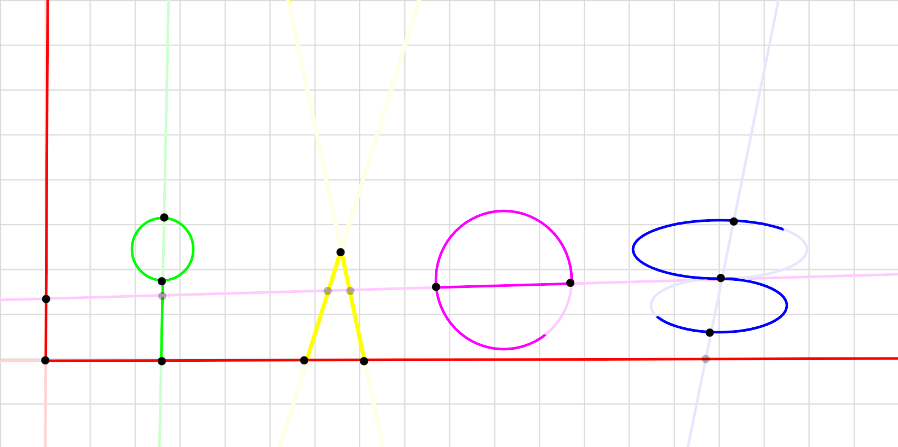

> This is an educational game.

Practice parallel and perpendicular lines and secant, tangent and external lines in a gameified way!

# Modes:
## Circle-line intersection
This problem type has a line and a circle, you have to select which type of intersection it counts as:
- Exterior (Line not touching circle)
- Tangent (Line touching circle in one point)
- Secant (Line touching circle in two points)
## Line-line intersection
This problem type has two lines, you have to select which type of intersection it counts as:
- Perpendicular (Lines intersect at a 90deg angle, this holds when `m1 = (-1 / m2)` where `m` is the slope of each line)
- Secant (Lines intersect at a non 90deg angle)
- Parallel (Lines do not intersect, this holds when `m1 = m2` where `m` is the slope of each line)
## Mixed
Play both modes, alternating problem type randomly.

---

When you finish playing just press the finish button, this will tell you your score and time you took, you can use this to teach in the classroom by telling your students to play for two minutes or to get 40 right, then you can ask them to show you the end screen to confirm they did the classwork or homework.
